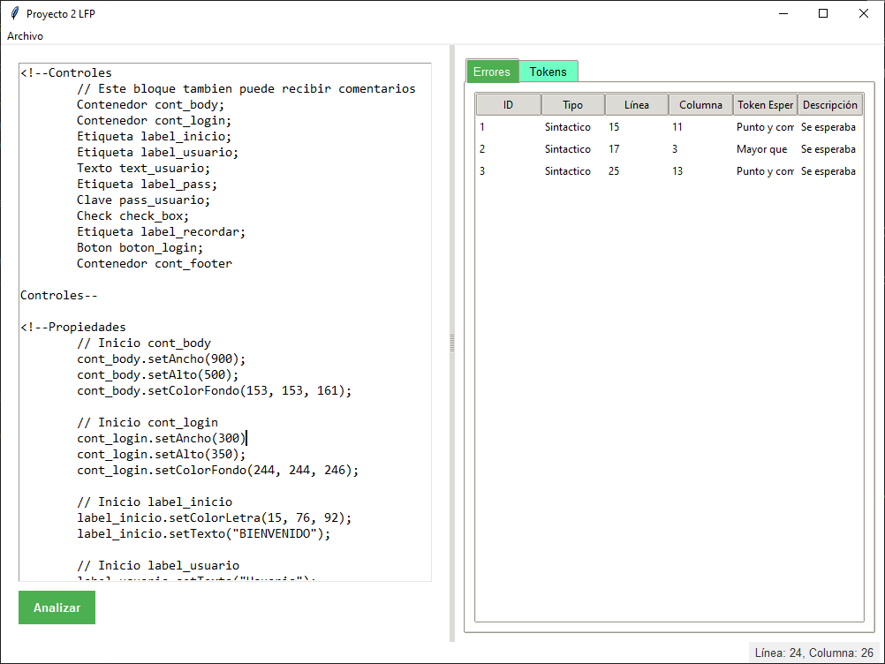

# Manual de Usuario
- Diego Alejandro Vásquez Alonzo
- Carné : 202300638


## Proyecto 2 - Lenguajes Formales y de Programación B+

## Índice

1. [Introducción](#introducción)
2. [Requisitos del Sistema](#requisitos-del-sistema)
3. [Interfaz Principal](#interfaz-principal)
4. [Funcionalidades Básicas](#funcionalidades-básicas)
5. [Área de Trabajo](#área-de-trabajo)
6. [Análisis de Código](#análisis-de-código)
7. [Visualización de Resultados](#visualización-de-resultados)
8. [Errores Comunes](#errores-comunes)

## Introducción

Esta aplicación es una herramienta de diseño web que permite crear páginas web de manera sencilla mediante un lenguaje personalizado. El programa proporciona una interfaz gráfica intuitiva donde podrás escribir tu código, analizarlo y visualizar los resultados.

## Requisitos del Sistema

- Sistema operativo Windows, Linux o macOS
- Python 3.x instalado
- Fortran instalado
- Tkinter (generalmente viene incluido con Python)

## Interfaz Principal

La interfaz del programa está dividida en dos secciones principales:

- **Panel Izquierdo**: Área de edición de código
- **Panel Derecho**: Área de resultados con dos pestañas:
  - Errores
  - Tokens

### Barra de Menú

En la parte superior encontrarás las siguientes opciones:

- **Archivo**
  - Nuevo
  - Abrir
  - Guardar
  - Guardar Como

## Funcionalidades Básicas

### Crear un Nuevo Archivo

1. Haz clic en "Archivo" > "Nuevo"
2. Si hay cambios sin guardar, el programa te preguntará si deseas guardarlos
3. El área de edición se limpiará para comenzar un nuevo archivo

### Abrir un Archivo Existente

1. Haz clic en "Archivo" > "Abrir"
2. Selecciona un archivo con extensión `.lfp`
3. El contenido se cargará en el área de edición

### Guardar un Archivo

1. Haz clic en "Archivo" > "Guardar" si el archivo ya existe
2. Si es un archivo nuevo, usa "Guardar Como"
3. Elige la ubicación y nombre del archivo (debe tener extensión `.lfp`)

## Área de Trabajo

### Editor de Código

- El editor muestra el número de línea y columna actual en la barra de estado
- Soporta resaltado básico de sintaxis
- Permite escribir comentarios de una línea (`//`) y múltiples líneas (`/* */`)

### Estructura del Código

Tu código debe seguir esta estructura básica:

```
<!--Controles
// Definición de controles
Controles -->

<!--propiedades
// Definición de propiedades
propiedades -->

<!--Colocación
// Posicionamiento de elementos
Colocación -->
```

## Análisis de Código

### Ejecutar el Análisis

1. Guarda tu archivo primero
2. Haz clic en el botón "Analizar"
3. El programa realizará:
   - Análisis léxico
   - Análisis sintáctico
   - Generación de archivos HTML/CSS (si no hay errores)

### Visualización de Tokens

En la pestaña "Tokens" podrás ver:

- ID del token
- Tipo de token
- Valor
- Línea
- Columna


### Visualización de Errores

En la pestaña "Errores" se mostrarán:

- Tipo de error (léxico o sintáctico)
- Línea del error
- Columna del error
- Token esperado
- Descripción del error



## Controles Disponibles

### Tipos de Controles

1. **Etiqueta**

   - Propiedades: ID, Color de letra, Texto, Color de Fondo

2. **Botón**

   - Propiedades: ID, Texto, Alineación de texto

3. **Check**

   - Propiedades: ID, Texto, Marcada o no, Grupo

4. **RadioBoton**

   - Propiedades: ID, Texto, Marcada o no, Grupo

5. **Texto**

   - Propiedades: ID, Texto, Alineación de texto

6. **AreaTexto**

   - Propiedades: ID, Texto

7. **Clave**

   - Propiedades: ID, Texto, Alineación de texto

8. **Contenedor**
   - Propiedades: ID, Ancho, Alto, Color de Fondo

## Errores Comunes

### Problemas Frecuentes y Soluciones

1. **Error al guardar**

   - Asegúrate de tener permisos de escritura en la carpeta
   - Verifica que el archivo no esté abierto en otro programa

2. **Error en el análisis**

   - Verifica que el archivo esté guardado
   - Revisa la estructura básica del código
   - Comprueba que todos los bloques estén correctamente cerrados

3. **No se generan archivos HTML/CSS**
   - Asegúrate de que no hay errores en el análisis
   - Verifica que tienes permisos de escritura en la carpeta de destino

## Consejos y Buenas Prácticas

1. **Organización del Código**

   - Mantén un orden lógico en la definición de controles
   - Usa comentarios para documentar secciones importantes
   - Agrupa los controles relacionados

2. **Nombrado de Elementos**

   - Usa nombres descriptivos para los IDs
   - Evita espacios en los nombres
   - Mantén consistencia en el estilo de nombrado

3. **Respaldo**
   - Guarda frecuentemente tu trabajo
   - Mantén copias de seguridad de tus archivos importantes
